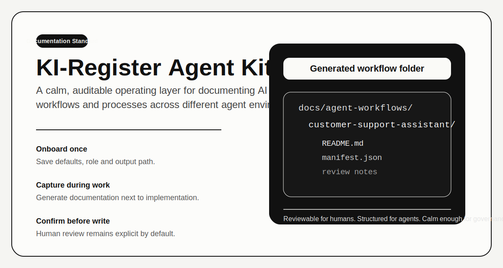
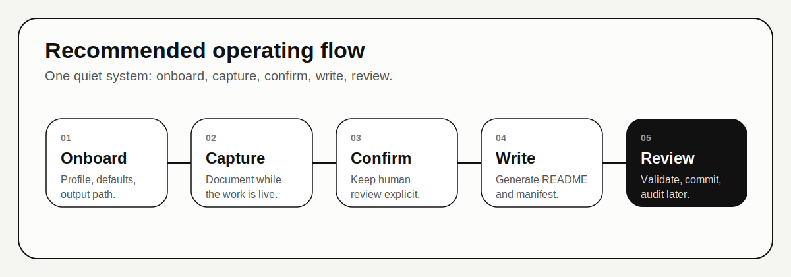

<p align="center">
  
</p>

# KI-Register Agent Kit

Documentation-first tooling for AI applications, processes and workflows that need to stay understandable for operators, usable by coding agents, and defensible under EU AI Act-style governance.

> This kit is built to support compliance work, engineering handoffs and internal review. It is not legal advice and does not replace a formal conformity or legal assessment.

<p align="center">
  <a href="#quick-start">Quick start</a> ·
  <a href="#why-this-format">Why this format</a> ·
  <a href="#operating-model">Operating model</a> ·
  <a href="#compliance-mapping">Compliance mapping</a> ·
  <a href="#distribution">Distribution</a>
</p>

## Why this format

The public AI Act materials point in the same direction:

- [Regulation (EU) 2024/1689](https://eur-lex.europa.eu/eli/reg/2024/1689/oj/eng) expects structured technical documentation for relevant AI systems, with Annex IV calling out intended purpose, system context, software versions and instructions for use.
- The same regulation introduces obligations around record keeping and logging in Article 12, human oversight in Article 14, and incident-report readiness for high-risk systems in Article 73.
- The Commission's [draft guidance and incident reporting template](https://digital-strategy.ec.europa.eu/en/consultations/ai-act-commission-issues-draft-guidance-and-reporting-template-serious-ai-incidents-and-seeks) shows that teams benefit from keeping operational facts and evidence ready before a serious event happens.
- The Commission's [AI literacy practice example from Mural](https://digital-strategy.ec.europa.eu/en/policies/ai-literacy-practices/mural) highlights use-case cards as an auditable record and a collaboration bridge between legal, product and engineering teams.

This repository turns those ideas into a practical operating standard:

- one machine-readable manifest per use case
- one human-readable README per use case
- one lightweight onboarding flow per workspace
- one default confirmation step before every write
- one format that multiple agent systems can share

## What you get

| Component | Purpose | Why it matters |
| --- | --- | --- |
| `bin/studio-agent.mjs` | Standalone Node CLI | Works locally, in CI, and in agent runtimes without framework lock-in |
| `skills/studio-use-case-documenter/` | Portable skill folder | Easy to publish to skill marketplaces and reuse in Codex-style systems |
| `schemas/studio-use-case.schema.json` | Canonical manifest contract | Makes documentation machine-readable and validation-friendly |
| `examples/sample-use-case.json` | Starter payload | Good for automation, testing and onboarding |
| `examples/slash-command.md` | Generic slash-command pattern | Helpful for agents that support custom command aliases |

## Quick start

```bash
# 0. Get the repository
git clone https://github.com/Egonso/ki-register-agent-kit.git
cd ki-register-agent-kit

# 1. Store your defaults once
node ./bin/studio-agent.mjs onboard

# 2. Capture during coding or implementation work
node ./bin/studio-agent.mjs capture

# 3. Run a deeper interview when more context is needed
node ./bin/studio-agent.mjs interview

# 4. Validate any generated manifest
node ./bin/studio-agent.mjs validate ./docs/agent-workflows/<slug>/manifest.json
```

Default output:

```text
docs/agent-workflows/<slug>/
  README.md
  manifest.json
```

## Operating model

<p align="center">
  
</p>

### Recommended command patterns

```bash
# Low-friction path for day-to-day implementation work
node ./bin/studio-agent.mjs capture --title "HR copilot" --systems "Greenhouse, Claude"

# Structured non-interactive path
node ./bin/studio-agent.mjs create --input ./examples/sample-use-case.json

# List all known workflow folders
node ./bin/studio-agent.mjs list --json
```

### Best-practice usage rules

1. Onboard once per workspace so the CLI knows who you are, where to write, and what defaults to apply.
2. Prefer `capture` during normal development so documentation happens in the same flow as the code.
3. Keep confirmation enabled by default. The extra review step is a governance feature, not friction for its own sake.
4. Use `interview` when the agent or developer does not yet know the process, risks, or human checkpoints.
5. Update an existing workflow folder instead of creating duplicates for the same operational use case.

## What good output looks like

Every workflow folder should answer the questions reviewers normally ask:

- What is the intended purpose?
- Who owns it?
- Which systems are involved and in what order?
- Which humans still review or approve outcomes?
- Which risks and controls are already known?
- Which artifacts could support an audit or later incident review?

The kit intentionally stores that twice:

- `manifest.json` for agents, validation and automation
- `README.md` for operators, legal review and governance conversations

## Compliance mapping

| AI Act-oriented expectation | Why teams care | How this kit helps |
| --- | --- | --- |
| Intended purpose and system context | Annex IV expects a general description of the AI system and how it interacts with other software or hardware | `title`, `purpose`, `systems`, and workflow metadata capture the operational shape early |
| Record keeping and traceability | Logging and traceability reduce later reconstruction work | One manifest per use case creates a stable, versionable audit trail in Git |
| Human oversight | Article 14 focuses on effective oversight and intervention | `humansInLoop`, `controls`, and confirmation-before-write keep review explicit |
| Evidence for incident response | Article 73 preparation is easier when facts already exist | `artifacts`, `steps`, and `risks` create a baseline for later review or incident reporting |
| Cross-functional collaboration | Legal, product and engineering need the same source of truth | The README + manifest pair serves humans and machines at the same time |

## Design principles

- Machine-readable first, but never machine-only.
- Documentation should happen next to delivery work, not in a separate project.
- Human review stays in the loop by default.
- One use case should have one durable folder, not scattered notes.
- Agent portability matters: the same package should work in Codex, Claude Code, OpenClaw, SkillsMP, Antigravity and plain shell-based workflows.

## Slash-command pattern

If your agent runtime supports custom slash commands, use the pattern in [`examples/slash-command.md`](./examples/slash-command.md).

Recommended behavior:

- run onboarding automatically if no local config exists
- prefer `capture` for normal implementation work
- ask only for missing required fields
- require final confirmation before writing files

## Distribution

This package is intentionally shaped so it can be:

- committed directly inside a product repository
- published as a standalone GitHub repository
- zipped for an in-product download page
- submitted to skill marketplaces as a CLI + skill bundle

For marketplace or public GitHub publication, the minimum clean package is:

```text
ki-register-agent-kit/
  README.md
  assets/
  bin/
  examples/
  marketplaces/
  schemas/
  skills/
  package.json
```

This standalone repository uses `https://github.com/Egonso/ki-register-agent-kit`.

## Open-source health

The package already includes the baseline files expected from a serious public repository:

- `LICENSE`
- `CONTRIBUTING.md`
- `CODE_OF_CONDUCT.md`
- `SECURITY.md`
- `SUPPORT.md`
- `GOVERNANCE.md`
- `.github/ISSUE_TEMPLATE/*`
- `.github/workflows/validate.yml`

That keeps the GitHub repository ready for contribution, reporting, and marketplace-style redistribution without needing a second cleanup pass.

## Source references

- [EUR-Lex: AI Act Regulation (EU) 2024/1689](https://eur-lex.europa.eu/eli/reg/2024/1689/oj/eng)
- [European Commission: AI Act Service Desk and Single Information Platform](https://digital-strategy.ec.europa.eu/en/news/commission-launches-ai-act-service-desk-and-single-information-platform-support-ai-act)
- [European Commission: draft guidance and reporting template on serious AI incidents](https://digital-strategy.ec.europa.eu/en/consultations/ai-act-commission-issues-draft-guidance-and-reporting-template-serious-ai-incidents-and-seeks)
- [European Commission: Mural AI literacy practice and use-case cards](https://digital-strategy.ec.europa.eu/en/policies/ai-literacy-practices/mural)
