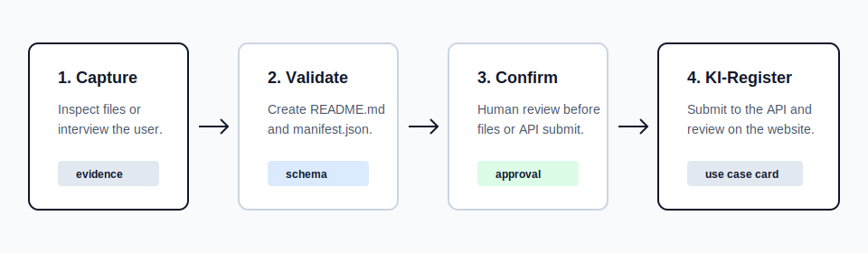
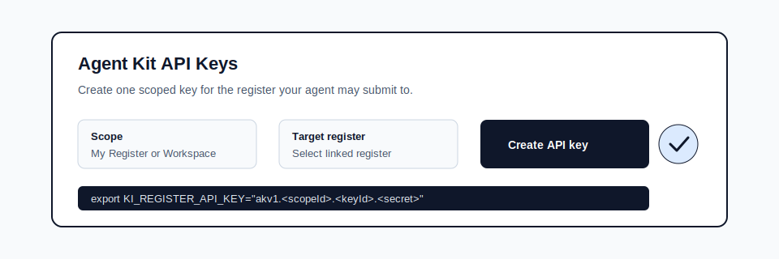

# Direct Submission To KI-Register

This guide is for the technical person who sets up the handoff once so the rest of the team can simply review the result inside KI-Register.



## Who needs what

- Team leads and reviewers need the final use case on the KI-Register website.
- Technical teams or agent owners need the Agent Kit repository, CLI, and API key setup.
- Coding agents such as Codex, Claude Code, OpenClaw, Antigravity, or shell-based agents only need three things:
  - the repository or ZIP
  - a workspace-scoped register id
  - a personal Agent Kit API key

## What happens end to end

1. A workspace member creates a personal Agent Kit API key in the KI-Register workspace control area.
2. The agent documents the new AI application, process, or workflow with `capture` or `interview`.
3. A human confirms the generated `manifest.json`.
4. The CLI submits that confirmed manifest to KI-Register.
5. The team lead sees a real use case card on the website.

The important part is that the team lead does not need to read local files or understand the CLI.

## Workspace setup

Create the API key in the workspace control area and choose the target register first.



After the key is created, keep these values ready:

- `KI_REGISTER_API_KEY`
- `KI_REGISTER_REGISTER_ID`
- submit endpoint
  - production default: `https://kiregister.com/api/agent-kit/submit`

## CLI setup

Clone the repository and save your non-secret defaults once:

```bash
git clone https://github.com/Egonso/ki-register-agent-kit.git
cd ki-register-agent-kit
node ./bin/studio-agent.mjs onboard
```

`onboard` can store the default submit endpoint and register id, but the API key should stay in an environment variable instead of local config.

## Submit command

Once a manifest exists and has been confirmed by a human, submit it like this:

```bash
export KI_REGISTER_API_KEY="akv1.<workspaceId>.<keyId>.<secret>"
export KI_REGISTER_REGISTER_ID="reg_123"

node ./bin/studio-agent.mjs submit \
  ./docs/agent-workflows/<slug>/manifest.json \
  --endpoint "https://kiregister.com/api/agent-kit/submit"
```

The command returns the new `useCaseId` plus the detail URL when submission succeeds.

## Example prompts for agents

### Codex App or Claude Code

```text
Use the local ki-register-agent-kit repository in this workspace. If there is no onboarding yet, run onboarding first. Document this new AI use case, ask me about missing facts, show me the summary before writing, and after my confirmation submit the manifest to KI-Register with the configured API key and register id.
```

### OpenClaw or skill-based agents

```text
Use the studio-use-case-documenter skill. If no local profile exists, onboard me first. Capture this new workflow, interview me about purpose, owner, data, risks, controls, and human checkpoints, then submit the confirmed manifest to our KI-Register register.
```

### Generic shell-based agent

```text
Use the ki-register-agent-kit CLI in this repository. Ask for missing information, create the documentation only after I confirm it, and then run studio-agent submit for the final manifest.
```

## What non-technical stakeholders should expect

- They should not need the ZIP or GitHub repository.
- They should not need to read `manifest.json`.
- They should not need to understand the CLI command.
- They should only need the resulting use case entry in KI-Register.

That separation keeps the operational setup with the technical team while the review surface stays on the product website.
