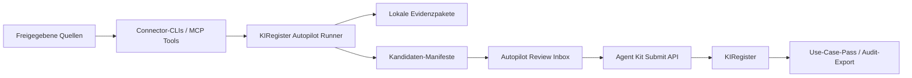

# KIRegister Autopilot Technical Spec

Stand: 2026-06-17
Status: Arbeitsfähige v0-Spezifikation
Owner: KIRegister Produkt und Studio Engineering

## Kurzentscheidung

Wir ändern die Produktstrategie von "Menschen dokumentieren KI-Nutzung manuell"
zu "Agenten bereiten KI-Registereinträge aus erlaubten Quellen vor, Menschen
prüfen nur die entscheidungsrelevanten Stellen".

Das ist nicht nur bequemer. Es löst den eigentlichen Produktwiderstand:
Organisationen wollen Compliance, aber sie wollen kein dauerhaftes
Formularritual.

## Produktversprechen

KIRegister Autopilot läuft optional auf einem lokalen Rechner, in einer
kontrollierten Workspace-Umgebung oder später als gemanagter Connector. Er
liest nur freigegebene Quellen, erkennt Hinweise auf KI-Einsatz, schreibt
lokale Entwürfe und stellt nur dann Fragen, wenn der Registereintrag ohne
menschliche Klärung nicht verantwortbar wäre.

Kurzform:

> Das KI-Register pflegt sich weitgehend selbst. Menschen werden nur gefragt,
> wenn Verantwortung, Unklarheit oder Freigabe nötig ist.

## Kritik an der ersten Idee

Die erste, harte Autopilot-Idee ist attraktiv, aber zu gefährlich, wenn sie
als "KI macht Compliance automatisch" verstanden wird.

Probleme:

1. Vollautomatische Governance wäre unglaubwürdig. Kunden mit echter
   Verantwortung werden einem System nicht blind erlauben, Risikoklassen,
   Datenkategorien oder Freigaben final zu setzen.
2. Ein lokaler Agent kann als Überwachung empfunden werden, wenn Quellen,
   Speicherorte und Schreibrechte nicht sehr klar begrenzt sind.
3. Zu viele Benachrichtigungen zerstören den Nutzen. Wenn der Agent dauernd
   fragt, ist er nur ein Formular mit Umweg.
4. Zu wenig Benachrichtigungen sind ebenfalls gefährlich. Dann entstehen
   stille, plausibel klingende Registereinträge ohne tragfähige Verantwortung.
5. MCP- und Connector-Wildwuchs kann schnell mehr Risiko als Nutzen erzeugen,
   wenn jeder Connector andere Auth-, Datenschutz- und Evidenzregeln hat.

## Verbesserte Fassung

Wir bauen keinen "Compliance-Autopiloten". Wir bauen einen
**Review-first Dokumentationsagenten**.

Der Agent darf:

- Hinweise sammeln
- Evidenz zusammenfassen
- Entwürfe erstellen
- bestehende Einträge zur Aktualisierung vorschlagen
- unklare Fragen markieren
- nach Bestätigung an KIRegister einreichen

Der Agent darf nicht:

- finale Risikoklassen selbst beschließen
- rechtliche Bewertungen als abgeschlossen markieren
- nicht freigegebene Quellen lesen
- bestehende Registereinträge still verändern
- besondere Datenkategorien ohne explizite Prüfung einreichen

Damit bleibt die Produktbotschaft sexy, aber belastbar:

> Autopilot übernimmt den Fleißteil. Menschen behalten die Verantwortung.

## Modi

### 1. Manuell

Klassische Registerführung mit Formularen, Import und Detailseiten. Dieser
Modus bleibt wichtig für skeptische oder stark regulierte Organisationen.

### 2. Assistiert

Das bestehende Agent Kit dokumentiert während der Arbeit, erzeugt
`manifest.json` und `README.md` und reicht nach Bestätigung in KIRegister ein.

### 3. Autopilot

Ein lokaler oder workspace-gebundener Agent läuft nach Zeitplan, zum Beispiel
täglich oder alle drei Tage. Er erstellt Kandidaten und Evidenzpakete und
benachrichtigt nur bei offenen Review-Fragen.

## Architektur



## Systemkomponenten

### Local Autopilot Runner

Verantwortung:

- Policy laden
- erlaubte Quellen ausführen
- Evidenz normalisieren
- Kandidaten erzeugen
- Review-Fragen ableiten
- lokale Artefakte schreiben
- optional nach Bestätigung einreichen

Keine Verantwortung:

- Scheduler installieren
- Quellen ohne Freigabe lesen
- formale Entscheidungen treffen

### Connector-Schicht

Connectoren werden bevorzugt als kleine CLIs gebaut, später optional mit MCP.
Printing Press ist dafür die passende Werkbank.

Startquellen:

- lokale `docs/agent-workflows`
- Repository-Metadaten und Paketdateien
- vorhandene Agent-Kit-Manifeste

Spätere Quellen:

- GitHub
- Google Drive
- Slack oder Teams
- Browser-/App-Nutzungsdaten nur mit sehr explizitem Opt-in
- SaaS-Admin-Exports
- Rechnungs- und Tool-Listen

### Operator API

Die bestehende Submit-API bleibt. Zusätzlich brauchen wir eine bewusst
freigegebene Operator-API für read-only und später Review-Schreibvorgänge.

Sprint 1 ist als read-only Slice umgesetzt und dokumentiert in
[`docs/kiregister/operator-api-sprint-1.md`](./operator-api-sprint-1.md).
Sprint 2 ergänzt die lokale CLI-Nutzung und ist dokumentiert in
[`docs/kiregister/operator-cli-sprint-2.md`](./operator-cli-sprint-2.md).
Sprint 3 ergänzt die Candidate-Inbox als getrennten Schreibpfad und ist
dokumentiert in
[`docs/kiregister/candidate-inbox-sprint-3.md`](./candidate-inbox-sprint-3.md).
Sprint 4 ergänzt die lokale Candidate-CLI und ist dokumentiert in
[`docs/kiregister/candidate-cli-sprint-4.md`](./candidate-cli-sprint-4.md).
Sprint 5 ergänzt die Agent-Kit-Key-Oberfläche um explizite Scope-Auswahl und
ist dokumentiert in
[`docs/kiregister/scope-ui-sprint-5.md`](./scope-ui-sprint-5.md).
Sprint 6 ergänzt die menschliche Candidate Review Inbox und ist dokumentiert
in
[`docs/kiregister/candidate-review-ui-sprint-6.md`](./candidate-review-ui-sprint-6.md).
Sprint 7 ergänzt die formale Review-Entscheidung ohne Merge und ist
dokumentiert in
[`docs/kiregister/candidate-review-decision-sprint-7.md`](./candidate-review-decision-sprint-7.md).
Sprint 8 ergänzt die kontrollierte Übernahme akzeptierter Kandidaten und ist
dokumentiert in
[`docs/kiregister/candidate-merge-sprint-8.md`](./candidate-merge-sprint-8.md).
Sprint 9 ergänzt ein Duplicate-Review-Gate vor dem Merge und ist dokumentiert
in
[`docs/kiregister/candidate-duplicate-gate-sprint-9.md`](./candidate-duplicate-gate-sprint-9.md).
Sprint 10 ergänzt Status-Filter in der Review-Inbox und ist dokumentiert in
[`docs/kiregister/candidate-status-filter-sprint-10.md`](./candidate-status-filter-sprint-10.md).
Sprint 11 ergänzt Status-Filter für Candidate-Listen-APIs und CLI und ist
dokumentiert in
[`docs/kiregister/candidate-api-status-filter-sprint-11.md`](./candidate-api-status-filter-sprint-11.md).
Sprint 12 ergänzt bessere Review-Orientierung und leere Filterzustände und ist
dokumentiert in
[`docs/kiregister/candidate-review-orientation-sprint-12.md`](./candidate-review-orientation-sprint-12.md).
Die Sprints 9-13 sind zusätzlich als Härtungsbatch zusammengefasst in
[`docs/kiregister/candidate-hardening-batch-sprints-9-13.md`](./candidate-hardening-batch-sprints-9-13.md).
Die Sprints 14-18 ergänzen serverseitige Statuscounts, Merge-Voransicht und
Audit-Timeline-Nachweis und sind dokumentiert in
[`docs/kiregister/candidate-merge-assurance-sprints-14-18.md`](./candidate-merge-assurance-sprints-14-18.md).
Die Sprints 19-23 ergänzen Agent-Run-Protokolle, Run-Operator-API, CLI-Anbindung
und Kandidaten-Historie je Run und sind dokumentiert in
[`docs/kiregister/agent-run-protocol-sprints-19-23.md`](./agent-run-protocol-sprints-19-23.md).
Die Sprints 24-28 machen Run-Protokolle in der Review-Inbox sichtbar und
ergänzen den Run-Filter für Kandidaten. Sie sind dokumentiert in
[`docs/kiregister/agent-run-review-ui-sprints-24-28.md`](./agent-run-review-ui-sprints-24-28.md).
Die Sprints 29-33 ergänzen den exportfähigen Candidate-Review-Auszug und sind
dokumentiert in
[`docs/kiregister/candidate-review-export-sprints-29-33.md`](./candidate-review-export-sprints-29-33.md).

Aktive Endpunkte:

- `GET /api/agent/operator/registers`
- `GET /api/agent/operator/use-cases`
- `GET /api/agent/operator/use-cases/[useCaseId]`
- `GET /api/agent/operator/candidates`
- `GET /api/agent/operator/candidates/[candidateId]`
- `POST /api/agent/operator/candidates`
- `GET /api/agent/operator/runs`
- `POST /api/agent/operator/runs`
- `GET /api/agent/operator/runs/[runId]`
- `PATCH /api/agent/operator/runs/[runId]`
- `GET /api/workspaces/[orgId]/agent-kit/candidates`
- `GET /api/workspaces/[orgId]/agent-kit/candidates/[candidateId]`
- `PATCH /api/workspaces/[orgId]/agent-kit/candidates/[candidateId]/review`
- `GET /api/workspaces/[orgId]/agent-kit/candidates/[candidateId]/merge`
- `POST /api/workspaces/[orgId]/agent-kit/candidates/[candidateId]/merge`
- `GET /api/workspaces/[orgId]/agent-kit/runs`
- `GET /api/workspaces/[orgId]/agent-kit/runs/[runId]`
- `GET /api/workspaces/[orgId]/agent-kit/review-export`

Noch nicht aktiv:

- später: `PATCH /api/agent/operator/use-cases/[useCaseId]/review`

### Berechtigungen

Bestehende Agent-Kit-Keys werden nicht einfach zu Allmacht-Keys erweitert.
Wir brauchen Scopes:

- `submit:usecase`
- `read:register`
- `read:usecase`
- `read:audit`
- `write:candidate`
- `write:review-note`
- `write:status-proposal`

Bestehende Keys ohne Scope-Feld gelten aus Kompatibilitätsgründen als
`submit:usecase`. Read-only Operator-Keys bekommen bewusst `read:register` und
`read:usecase`; sie können nicht still in die Submit-API schreiben.

Die Produktoberfläche unterscheidet seit Sprint 5 drei Key-Modi:
`Submit-only`, `Read-only Operator` und `Candidate Operator`. Schreibende
Operator-Scopes werden nur für Owner und Admins angeboten und schreiben im
ersten Schritt ausschließlich in die Candidate-Inbox.

## Datenverträge

### AutopilotPolicy

```json
{
  "schemaVersion": "1.0.0",
  "kind": "kiregister.autopilot.plan",
  "cadence": "daily",
  "mode": "draft-only",
  "scope": "local-workstation",
  "target": {
    "registerId": "reg_123",
    "submitEndpoint": "https://kiregister.com/api/agent-kit/submit"
  },
  "policy": {
    "mayRead": ["docs/agent-workflows"],
    "mayWrite": ["local candidate manifests"],
    "neverDo": ["make final legal or compliance decisions"]
  }
}
```

### AutopilotRun

```json
{
  "runId": "apr_20260617_001",
  "startedAt": "2026-06-17T10:00:00.000Z",
  "cadence": "every-3-days",
  "sourceCount": 3,
  "candidateCount": 2,
  "reviewQuestionCount": 1,
  "status": "needs_review"
}
```

### EvidenceItem

```json
{
  "evidenceId": "ev_001",
  "source": "repository",
  "sourceRef": "package.json",
  "observedAt": "2026-06-17T10:00:00.000Z",
  "claim": "Repository uses OpenAI SDK",
  "confidence": 0.82,
  "excerpt": "openai dependency present",
  "sensitive": false
}
```

### CandidateUseCase

```json
{
  "candidateId": "cand_001",
  "title": "Support summary assistant",
  "purpose": "Draft support summaries for human review.",
  "systems": ["Zendesk", "OpenAI"],
  "confidence": 0.74,
  "status": "needs_review",
  "blockedBy": ["personal-or-sensitive-data"]
}
```

### ReviewQuestion

```json
{
  "questionId": "rq_001",
  "candidateId": "cand_001",
  "reason": "personal-or-sensitive-data",
  "question": "Which data categories are actually processed?",
  "blocks": "submission"
}
```

## Human-in-the-Loop-Regeln

Der Agent muss fragen, wenn:

- Owner oder Verantwortlichkeit unklar sind
- Kontext extern, kundenseitig, bewerberseitig oder öffentlich sein könnte
- personenbezogene, besondere oder vertrauliche Daten erkennbar sind
- Entscheidungseinfluss unklar ist
- Risikoklasse `HIGH` oder `PROHIBITED` möglich erscheint
- Evidenz unter einem Confidence-Schwellenwert liegt
- ein bestehender Registereintrag verändert werden soll

Der Agent darf ohne Frage lokale Entwürfe schreiben, solange sie nicht an
KIRegister übermittelt oder als final markiert werden.

## UI-Konzept nach Governance UI Charta

Die spätere Oberfläche heißt nicht "Magic Autopilot Dashboard".

Arbeitstitel:

- `Autopilot Review`
- `Offene Register-Kandidaten`
- `Autopilot-Laufprotokoll`

Primäres Objekt pro Seite:

- Review-Inbox: der Kandidat
- Run-Detail: der einzelne Autopilot-Lauf
- Candidate-Detail: der vorgeschlagene Einsatzfall

Tabelle der Review-Inbox, maximal 5 Kernspalten:

1. Einsatzfall
2. Status
3. Owner
4. Risikohinweis
5. Aktivität

Zulässige Aktionen:

- `Evidenz ansehen`
- `Frage beantworten`
- `Als Entwurf übernehmen`
- `Einreichen`
- `Verwerfen`

Nicht zulässig:

- aggressives "Autopilot aktivieren"
- farbige Dringlichkeitsinszenierung
- große Marketing-KPIs
- globale Utility-Leisten auf Detailseiten

## MCP-Strategie

MCP ist nicht die erste Produktoberfläche. MCP ist die agentische
Integrationsschicht.

v0 MCP-Tools:

- `kiregister_list_candidates`
- `kiregister_read_candidate`
- `kiregister_answer_review_question`
- `kiregister_submit_confirmed_manifest`
- `kiregister_export_audit_summary`

Prinzipien:

- read-only zuerst
- schreibende Tools nur mit klaren Scopes
- jede Mutation braucht `dry-run` oder explizite Bestätigung
- Tool-Beschreibungen müssen Grenzen nennen

## Printing-Press-Einsatz

Printing Press wird als Connector-Fabrik genutzt:

1. Interne KIRegister Operator API als OpenAPI-Spec drucken.
2. Daraus CLI und MCP erzeugen.
3. Für externe Quellen eigene Connector-CLIs bauen, zum Beispiel GitHub,
   Google Drive, Slack oder SaaS-Admin-Exports.
4. Autopilot Runner ruft Connector-CLIs auf und normalisiert deren Evidenz.

Wir sniffen die KIRegister-Website nicht als primären Weg. Das wäre instabil
und widerspricht dem Governance-Anspruch. Wir definieren die API bewusst.

## Implementierungsplan

### Sprint 0: Strategie und Policy-Fundament

Ziel:

- Neuausrichtung dokumentieren
- technische Spec schreiben
- erster CLI-Befehl für Autopilot-Policy

Lieferumfang:

- `docs/kiregister/autopilot-technical-spec.md`
- `docs/kiregister/README.md`
- `studio-agent autopilot plan`
- `studio-agent autopilot run`
- Smoke-Test für den neuen Befehl

Agent-Prompt:

```text
Lies die KIRegister Autopilot Technical Spec. Implementiere nur das
Policy-Fundament: CLI-Kommandos, die eine lokale Autopilot-Run-Policy erzeugen
und gegen ausdrücklich erlaubte lokale Quellen ausführen. Installiere keinen
Scheduler und greife auf keine externen Quellen zu.
```

### Sprint 1: Operator API read-only

Ziel:

- Agent-Kit-Keys um Scopes vorbereiten
- read-only Operator-Endpunkte bauen
- Register und Use Cases für Agenten lesbar machen

Lieferumfang:

- Scope-Modell für Agent-Kit-Keys
- `GET /api/agent/operator/registers`
- `GET /api/agent/operator/use-cases`
- Tests gegen Workspace- und Personal-Scope

Agent-Prompt:

```text
Baue die read-only KIRegister Operator API. Verwende bestehende
Agent-Kit-API-Key-Authentifizierung, aber führe explizite Scopes ein.
Keine Schreiboperationen. Keine UI. Tests müssen Workspace- und Personal-Scope
abdecken.
```

### Sprint 2: Lokaler Autopilot Runner

Ziel:

- Autopilot-Policy lesen
- erlaubte lokale Quellen scannen
- Kandidaten und Evidenzpakete erzeugen

Lieferumfang:

- `studio-agent autopilot run --policy <file>`
- lokale Kandidaten unter `_autopilot-candidates`
- Evidenz unter `_autopilot-evidence`
- keine automatische Einreichung

Agent-Prompt:

```text
Implementiere den lokalen Autopilot Runner. Er darf ausschließlich Quellen
lesen, die in der Policy stehen. Er schreibt lokale Kandidaten und Evidenz.
Er darf nichts an KIRegister senden.
```

### Sprint 3: Review-first Submission

Ziel:

- Kandidaten nach menschlicher Bestätigung einreichen
- offene Fragen sauber blockierend behandeln

Lieferumfang:

- `studio-agent autopilot review`
- `studio-agent autopilot submit-candidate <id>`
- Validierung gegen Agent-Kit-Manifest-Schema

Agent-Prompt:

```text
Baue die Review-Schicht für Autopilot-Kandidaten. Einreichung ist nur erlaubt,
wenn alle blockierenden Review-Fragen beantwortet sind und der Mensch bestätigt.
```

### Sprint 4: Review-Inbox UI

Ziel:

- ruhige, objektzentrierte Review-Fläche nach UI-Charta

Lieferumfang:

- Review-Inbox
- Candidate-Detail
- Run-Detail
- keine Marketing-Sprache
- Export-/Nachweisbezug sichtbar

Agent-Prompt:

```text
Lies zuerst docs/GOVERNANCE_UI_CHARTA.md. Baue eine ruhige Autopilot
Review-Inbox. Primäres Objekt ist der Kandidat. Keine SaaS-KPI-Optik, keine
Alarmfarben, keine globalen Utilities auf Detailseiten.
```

### Sprint 5: Printing-Press KIRegister Operator CLI/MCP

Ziel:

- OpenAPI-Spec für Operator API drucken
- CLI und MCP erzeugen
- Shipcheck und Dogfood durchführen

Lieferumfang:

- `kiregister-operator-pp-cli`
- MCP-Server für read-only und bestätigte Submit-Flows
- Dogfood mit Test-Register

Agent-Prompt:

```text
Nutze Printing Press mit der KIRegister Operator OpenAPI-Spec. Generiere CLI
und MCP. Read-only Tools zuerst, Submit nur mit bestätigt gültigem Manifest.
Shipcheck und Dogfood sind Pflicht.
```

### Sprint 6: Externe Connectoren

Ziel:

- erste reale Quelle anbinden
- Connector nicht direkt in KIRegister verdrahten, sondern über Evidenzschema

Startkandidaten:

- GitHub Repository Scanner
- Google Drive Dokumentenliste
- Slack/Teams nur nach explizitem Opt-in

Agent-Prompt:

```text
Baue einen einzelnen Connector als CLI. Er gibt normalisierte EvidenceItems
aus und verändert keine externen Daten. Printing Press bevorzugen, wenn eine
API-Spec oder stabile Dokumentation existiert.
```

## Definition of Done für v0

v0 ist fertig, wenn:

- ein lokaler Autopilot-Plan erzeugt werden kann
- der Runner lokale erlaubte Quellen lesen kann
- Kandidaten und Evidenz lokal entstehen
- offene Review-Fragen blockierend wirken
- bestätigte Kandidaten über die bestehende Submit-API eingereicht werden
- keine stillen Mutationen existieren
- UI-Charta für Review-Flächen eingehalten ist
- ein Test-Register mit mindestens einem vollständigen Autopilot-Durchlauf
  belegt ist

## Größtes Risiko

Das größte Risiko ist nicht technische Komplexität. Das größte Risiko ist
Vertrauen. Wenn Autopilot wie Überwachung oder wie automatische Compliance
wirkt, verliert das Produkt gerade die Kunden, die es ernst meinen.

Darum bleibt die Regel:

> Der Agent macht Arbeit sichtbar. Der Mensch übernimmt Verantwortung.
