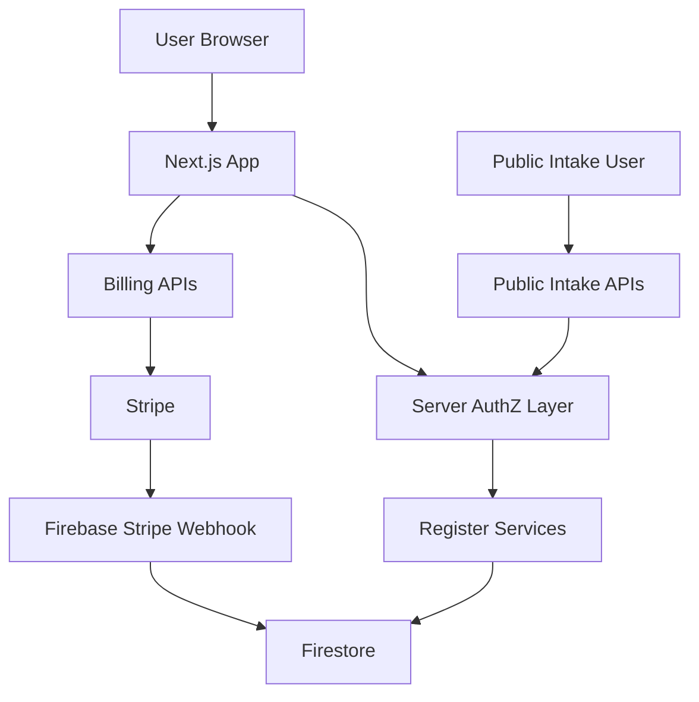

## Executive summary

Die höchsten Risiken dieses Repos liegen nicht mehr in offensichtlichen UI-Schwächen, sondern in drei Bereichen: Billing-/Entitlement-Integrität, mandantengetrennter Workspace-Zugriff und Missbrauch öffentlicher Intake-Flächen. Der Code enthält bereits starke serverseitige Authentifizierung, Firestore-Regeln und signierte Supplier-Tokens, aber ein erfolgreicher Angreifer würde heute am ehesten über operatives Secret-Handling, öffentliche Endpoint-Abuse-Pfade oder Inkonsistenzen zwischen Workspace-Mitgliedschaft und owner-scoped Registerpfaden angreifen.

## Scope and assumptions

- In scope: `src/app/api/**`, `src/app/control/**`, `src/app/request/**`, `src/app/erfassen/**`, `src/lib/billing/**`, `src/lib/register-first/**`, `src/lib/server-auth.ts`, `src/lib/server-access.ts`, `src/lib/firebase-admin.ts`, `firestore.rules`, `functions/src/**`.
- Out of scope: lokale Entwicklungs-Workflows, ungenutzte Legacy-Seiten ohne kanonische Navigation, Drittanbieter-Infrastruktur außerhalb des Repos.
- Assumptions:
  - Produktion läuft über Next.js auf Netlify plus Firebase/Firestore plus Firebase Functions.
  - `STRIPE_SECRET_KEY` und `STRIPE_WEBHOOK_SECRET` sind serverseitig gesetzt und nicht clientseitig exponiert.
  - Nur authentifizierte Workspace-Mitglieder sollen geschützte Register-/Control-Daten lesen oder schreiben.
  - Öffentliche Intake-Flächen sind internetexponiert und müssen mit Missbrauch rechnen.
- Open questions:
  - Ist Secret-Rotation für bereits extern offengelegte Stripe-Secrets abgeschlossen?
  - Gibt es zusätzliches Edge-Rate-Limiting/WAF vor Netlify/Firebase?
  - Werden große Enterprise-Workspaces künftig auf ein physisch workspace-zentriertes Datenmodell migriert?

## System model

### Primary components

- Public marketing/auth shell: `/`, `/login`, `/einrichten`, umgesetzt in [src/components/auth/auth-entry-page.tsx](src/components/auth/auth-entry-page.tsx) und [src/lib/auth/auth-entry-controller.ts](src/lib/auth/auth-entry-controller.ts).
- Signed-in register product: `/my-register`, `/capture`, `/settings`, umgesetzt in [src/app/my-register/page.tsx](src/app/my-register/page.tsx), [src/lib/register-first/register-service.ts](src/lib/register-first/register-service.ts), [src/lib/register-first/register-repository.ts](src/lib/register-first/register-repository.ts).
- Paid governance control: `/control/**`, `/academy`, inklusive neuem Post-Purchase-Onboarding in [src/app/control/welcome/page.tsx](src/app/control/welcome/page.tsx).
- Public intake: `/erfassen`, `/request/[registerId]`, `/api/capture-by-code`, `/api/supplier-submit`, umgesetzt in [src/app/api/capture-by-code/route.ts](src/app/api/capture-by-code/route.ts), [src/app/api/supplier-submit/route.ts](src/app/api/supplier-submit/route.ts), [src/lib/register-first/request-token-admin.ts](src/lib/register-first/request-token-admin.ts).
- Billing/entitlements: [src/app/api/billing/checkout/route.ts](src/app/api/billing/checkout/route.ts), [src/app/api/billing/portal/route.ts](src/app/api/billing/portal/route.ts), [src/app/api/entitlements/sync/route.ts](src/app/api/entitlements/sync/route.ts), [src/lib/billing/stripe-server.ts](src/lib/billing/stripe-server.ts), [functions/src/index.ts](functions/src/index.ts).
- AuthZ core: [src/lib/server-auth.ts](src/lib/server-auth.ts), [src/lib/server-access.ts](src/lib/server-access.ts), [firestore.rules](firestore.rules).

### Data flows and trust boundaries

- Browser -> Next.js app routes  
  Data: auth context, checkout return IDs, workspace selection, use-case inputs.  
  Channel: HTTPS.  
  Controls: Firebase Auth in client plus server verification in route handlers/server actions.

- Browser -> public intake APIs  
  Data: access codes, signed supplier request tokens, submission payloads.  
  Channel: HTTPS POST.  
  Controls: Zod parsing, token verification, immutable submission records, instance-local rate limits.  
  Evidence: [src/app/api/capture-by-code/route.ts](src/app/api/capture-by-code/route.ts), [src/app/api/supplier-submit/route.ts](src/app/api/supplier-submit/route.ts).

- Browser -> authenticated Next.js APIs  
  Data: Firebase ID token in `Authorization`, register/workspace IDs, billing actions.  
  Channel: HTTPS fetch.  
  Controls: `requireUser`, `requireWorkspaceMember`, `requireRegisterOwner`.  
  Evidence: [src/lib/server-auth.ts](src/lib/server-auth.ts), [src/app/api/billing/checkout/route.ts](src/app/api/billing/checkout/route.ts), [src/app/api/registers/[registerId]/external-submissions/route.ts](src/app/api/registers/[registerId]/external-submissions/route.ts).

- Next.js server -> Firestore  
  Data: register docs, use cases, entitlements, external submissions, workspace metadata.  
  Channel: Admin SDK.  
  Controls: server-side owner/workspace resolution, Firestore rules for client reads/writes, denormalized workspace membership model.  
  Evidence: [src/lib/register-first/register-scope.ts](src/lib/register-first/register-scope.ts), [src/lib/server-access.ts](src/lib/server-access.ts), [firestore.rules](firestore.rules).

- Next.js/Firebase Functions -> Stripe  
  Data: checkout session creation, customer portal session, checkout retrieval, webhook events.  
  Channel: Stripe API / webhook HTTPS.  
  Controls: server-only secret resolution, API version pinning, completed-checkout and active-subscription verification.  
  Evidence: [src/lib/billing/stripe-server.ts](src/lib/billing/stripe-server.ts), [src/app/api/entitlements/sync/route.ts](src/app/api/entitlements/sync/route.ts), [functions/src/index.ts](functions/src/index.ts).

#### Diagram

## Assets and security objectives

| Asset | Why it matters | Security objective (C/I/A) |
| --- | --- | --- |
| Workspace/register data | Contains internal KI use cases, roles, reviews, audit data | C / I |
| External submissions | Publicly supplied provenance and supplier context must stay immutable and attributable | I / A |
| Billing entitlements | Unlocks paid product capabilities | I |
| Stripe/Firebase secrets | Compromise leads to billing fraud or backend compromise | C / I |
| Audit history and exports | Must be trustworthy for regulators and customers | I |
| Public trust disclosures | Must not leak unpublished or wrong customer data | C / I |

## Attacker model

### Capabilities

- Remote unauthenticated attacker can hit public marketing, public intake, and any accidentally unauthenticated route.
- Authenticated low-privilege user can try horizontal escalation across workspaces/registers.
- Attacker can replay leaked checkout URLs or promotion codes.
- Bot/spam actor can flood supplier or access-code intake endpoints.

### Non-capabilities

- No evidence of arbitrary shell execution endpoints in the runtime app paths reviewed here.
- No evidence that client-side types or hidden UI elements alone grant server-side access; critical routes use explicit auth helpers.
- No evidence that Stripe secrets are hardcoded in the repo.

## Entry points and attack surfaces

| Surface | How reached | Trust boundary | Notes | Evidence |
| --- | --- | --- | --- | --- |
| `/api/billing/checkout` | Authenticated POST | Browser -> billing server | Creates hosted Stripe Checkout sessions | [src/app/api/billing/checkout/route.ts](src/app/api/billing/checkout/route.ts) |
| `/api/entitlements/sync` | Authenticated POST with optional session ID | Browser -> billing server -> Stripe | Maps billing state into workspace/register entitlements | [src/app/api/entitlements/sync/route.ts](src/app/api/entitlements/sync/route.ts) |
| `/api/supplier-submit` | Public POST | Internet -> intake API | Signed token flow; now rate limited per IP+token in-instance | [src/app/api/supplier-submit/route.ts](src/app/api/supplier-submit/route.ts) |
| `/api/capture-by-code` | Public POST | Internet -> intake API | Access-code intake with rate limit and provenance write | [src/app/api/capture-by-code/route.ts](src/app/api/capture-by-code/route.ts) |
| `/api/registers/[registerId]/external-submissions/*` | Authenticated internal API | Browser -> protected register API | Approval/reject/merge for external inbox | [src/app/api/registers/[registerId]/external-submissions/[submissionId]/route.ts](src/app/api/registers/[registerId]/external-submissions/[submissionId]/route.ts) |
| `/api/stripe-session` | Public GET with session ID | Browser -> billing server -> Stripe | Returns masked email hint and plan context for checkout-return UX | [src/app/api/stripe-session/route.ts](src/app/api/stripe-session/route.ts) |
| Firestore client access | Frontend SDK | Browser -> Firestore | Enforced by rules plus denormalized membership fields | [firestore.rules](firestore.rules) |

## Top abuse paths

1. Attacker floods supplier intake with repeated submissions -> instance-local limiter resets on cold starts or parallel instances -> inbox noise or operational DoS.
2. Authenticated user tampers with workspace context -> tries to read/write another org’s register via guessed IDs -> server-side scope resolver/rules must stop horizontal access.
3. Attacker obtains a leaked Stripe checkout session ID -> probes checkout-return API for customer correlation or attempts entitlement sync -> completed-checkout and active-subscription validation reduce this to low-signal metadata leakage.
4. Malicious policy text or AI output injects HTML/JS into policy preview -> browser XSS in admin session -> fixed by escaping before markdown rendering, but any future raw HTML sink would reopen this class.
5. Compromised Stripe or Firebase secret outside the repo -> arbitrary subscription state, webhook forgery, or backend impersonation -> operational rotation and secret scoping remain critical.
6. Client and Firestore membership data drift out of sync -> stale denormalized roles grant or block access unexpectedly -> current write model keeps them aligned, but this remains a sensitive integrity dependency.

## Threat model table

| Threat ID | Threat source | Prerequisites | Threat action | Impact | Impacted assets | Existing controls (evidence) | Gaps | Recommended mitigations | Detection ideas | Likelihood | Impact severity | Priority |
| --- | --- | --- | --- | --- | --- | --- | --- | --- | --- | --- | --- | --- |
| TM-01 | Internet spam actor | Public supplier link or token | Flood `/api/supplier-submit` with repeated requests | Inbox spam, review fatigue, noisy notifications | External submissions, availability | Signed request tokens and per-instance rate limit in [src/app/api/supplier-submit/route.ts](src/app/api/supplier-submit/route.ts) | Limiter is memory-local, not shared across instances | Add edge or Redis-backed rate limiting before enterprise launch | Alert on unusually high submission counts per token/IP | Medium | Medium | Medium |
| TM-02 | Authenticated low-privilege user | Valid login in one workspace | Attempt cross-workspace register access | Confidentiality/integrity breach across customers | Register/workspace data | `requireWorkspaceMember`, `requireRegisterOwner`, scope resolver, Firestore rules in [src/lib/server-auth.ts](src/lib/server-auth.ts), [src/lib/register-first/register-scope.ts](src/lib/register-first/register-scope.ts), [firestore.rules](firestore.rules) | Physical storage is still owner-scoped, not workspace-scoped | Keep membership reconciliation monitored; move to first-class workspace-owned storage later | Audit logs on denied cross-workspace access and mismatched owner lookups | Medium | High | High |
| TM-03 | Attacker with leaked checkout URL | Known `cs_...` session ID | Query session helper or try entitlement sync before payment settles | Billing fraud or customer data hint leakage | Entitlements, customer identity hints | Completed-checkout and active-subscription verification in [src/app/api/stripe-session/route.ts](src/app/api/stripe-session/route.ts) and [src/app/api/entitlements/sync/route.ts](src/app/api/entitlements/sync/route.ts) | Public helper still returns a masked email hint | Keep session IDs out of logs; consider expiring helper use or adding signed state later | Monitor failed sync attempts and repeated 409/403s | Low | High | Medium |
| TM-04 | Malicious internal content author or compromised AI output | Ability to inject policy text | Render active HTML/JS in policy preview | Admin-session XSS and data exfiltration | Session context, internal governance data | Markdown now escaped before rendering in [src/lib/policy-engine/render-policy-markdown.ts](src/lib/policy-engine/render-policy-markdown.ts) | Other future `dangerouslySetInnerHTML` sinks could reintroduce risk | Keep raw HTML banned in customer-facing renderers; add CSP if not already done at edge | Sentry/logging for CSP violations and DOM XSS reports | Medium | High | High |
| TM-05 | Secret thief / operator mistake | Access to live Stripe or Firebase secrets | Forge billing state, create rogue webhooks, read backend data | Full financial and integrity compromise | Billing, entitlements, backend trust | Secrets resolved server-side only in [src/lib/billing/stripe-server.ts](src/lib/billing/stripe-server.ts), [functions/src/index.ts](functions/src/index.ts) | Secret rotation/process is operational, not enforced by repo | Rotate any externally exposed live keys immediately; use least-privilege secret distribution | Stripe audit logs, webhook endpoint drift checks, secret rotation runbooks | Medium | Critical | Critical |

## Focus paths for manual security review

- `src/app/api/entitlements/sync/route.ts`: paid-feature unlock path and Stripe session claim logic.
- `src/app/api/billing/checkout/route.ts`: hosted checkout creation and workspace/register association.
- `src/app/api/supplier-submit/route.ts`: public signed-token intake and immutable provenance.
- `src/app/api/capture-by-code/route.ts`: public no-login capture and abuse controls.
- `src/lib/server-auth.ts`: core authN/authZ helper layer for server actions and routes.
- `src/lib/register-first/register-scope.ts`: workspace vs owner path resolution.
- `src/lib/register-first/external-submission-service.ts`: internal inbox and approval access paths.
- `firestore.rules`: last line of defense for client-side data access.
- `functions/src/index.ts`: Stripe webhook verification and billing event mapping.
- `src/components/policy-engine/policy-preview.tsx`: rendered internal content in privileged sessions.

## Quality check

- Entry points covered: yes, for billing, public intake, protected register APIs, and client Firestore access.
- Trust boundaries represented in threats: yes, internet -> public APIs, browser -> protected APIs, app -> Stripe, app -> Firestore.
- Runtime vs CI/dev separated: yes; this model focuses on production runtime paths, not local tooling.
- Assumptions explicit: yes.
- User clarifications still open: secret rotation status, edge protections, and long-term workspace storage model.
